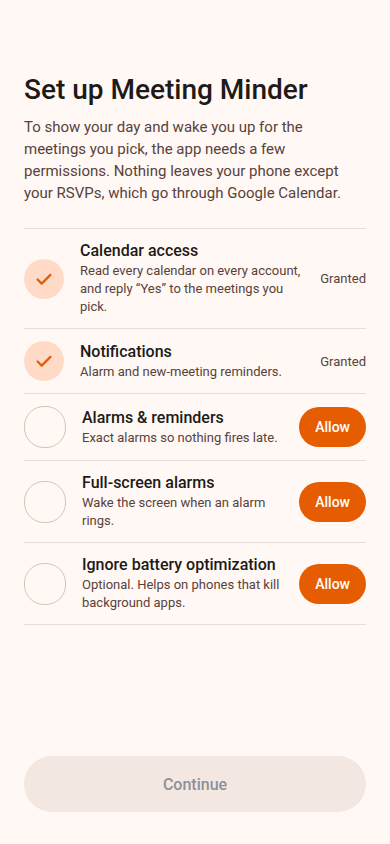
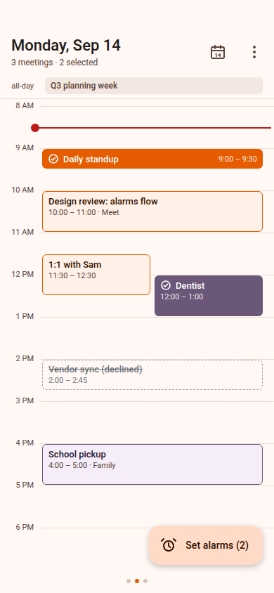
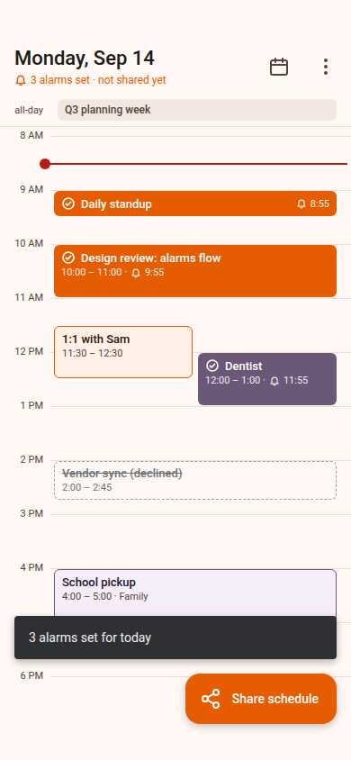
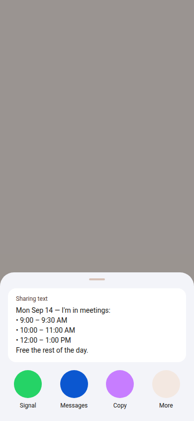
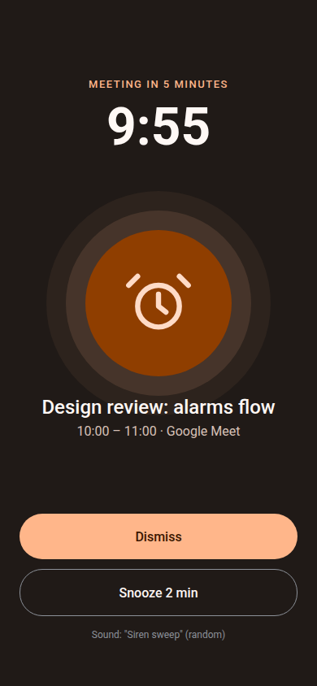
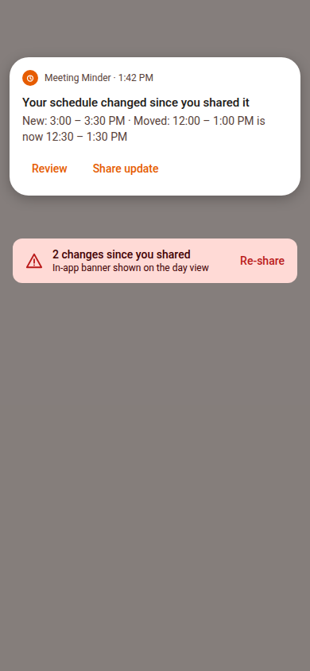

# Meeting Minder — Spec & Work Plan

> Status: **spec, nothing implemented yet.** This document is the source of truth for what we're
> building and in what order. Each "PR-N" section below is intended to be one reviewable pull
> request. Tick the checkbox when the PR merges. Renders of the target UI live in
> [`docs/renders/`](docs/renders/); the editable design canvas is at
> https://claude.ai/code/artifact/d344a51b-d816-4b42-9b97-187d99051ee6.

## 1. Product summary

Meeting Minder is an android-only episode6 app for one job: **every morning, look at today,
decide which meetings you're actually attending, get loud alarms for those, and send your
partner a "here's when I'm busy" text.** During the day it watches the calendar and nags you to
re-send the schedule when meetings appear or move.

- Reads **every calendar on every account** through the Android Calendar Provider (Google
  Calendar syncs into it). The only thing it ever writes back is your **RSVP**: setting alarms
  marks each chosen meeting "Yes, going" so Google Calendar renders it accepted and the organizer
  gets a response (§4.6). No network permission — the app never talks to a server itself.
- Main screen: a Google-Calendar-style **single-day itinerary** (timeline with hour grid,
  proportional event heights, overlapping events side by side) with **horizontal swiping between
  days**.
- **Tap an event to select/unselect it.** Selection means "I'm going to this."
- With ≥1 selection the FAB reads **"Set alarms (N)"**. Once alarms are set for the day, it
  changes to **"Share schedule"**, which opens the system share sheet with generated text that only
  lists **busy time ranges** (no titles).
- Alarms are **in-app, exact, alarm-clock class**: a full-screen activity that wakes the screen and
  plays a **randomized, obnoxious** alert so you don't habituate to it. Onboarding walks the user
  through every permission/special access needed.
- **Background monitoring**: after you've shared, the app notices new/moved/cancelled meetings
  for the rest of that day and posts a "your schedule changed since you shared it" notification with
  a one-tap re-share.

Not on Google Play; distributed as APKs from GitHub releases like headache-tracker. That frees us
to use `USE_EXACT_ALARM` and full-screen intents without Play policy review.

### Non-goals (v1)
- Editing the calendar beyond RSVP (creating/moving events, declining, responding to a whole
  series). Long-press opens the event in the calendar app for anything else.
- Multiple *apps* as sources. Calendar Provider only (Google Calendar, Samsung Calendar, Outlook w/ sync all land there).
- Week/month views, a settings-heavy UI, cloud sync, widgets. (Widget is a plausible v2.)
- Tablet/foldable-specific layouts beyond "don't look broken."

## 2. Screens (see renders)

| # | Render | Screen | Notes |
|---|--------|--------|-------|
| 1 |  | **Onboarding / permissions** | Calendar row covers read and RSVP write (one dialog). Checklist of grants; rows flip to "Granted" as they come back. Continue enabled once required ones are granted. Reachable later from overflow → "Permissions". |
| 2 |  | **Day view, selecting** | Top bar: date + subtitle ("3 meetings · 2 selected"), Today button, overflow. All-day row. Timeline. Outlined chip = not selected, filled chip + check = selected, dashed + strikethrough = declined. Red now-line on today. FAB "Set alarms (N)". |
| 3 |  | **Alarms set** | Selected chips show a bell + the alarm time. Subtitle "3 alarms set · not shared yet". Snackbar confirms. FAB becomes primary-filled "Share schedule". |
| 4 |  | **Share sheet** | System sharesheet; our text is plain, times only. |
| 5 |  | **Alarm ringing** | Full-screen, dark, over lock screen. Big clock, meeting title, time, Dismiss / Snooze. Shows which random sound is playing (debug aid, keep it subtle). |
| 6 |  | **Schedule changed** | Notification with "Review" and "Share update" actions; same info as an in-app banner on the day view until re-shared. |

Interaction rules:
- Tapping a chip toggles selection with a haptic tick. Declined/cancelled chips are not selectable
  (tap does nothing; long-press still opens the calendar).
- Changing selection **after** alarms are set puts the day back into the "Set alarms" state (the
  FAB label reverts) because the alarm set no longer matches. Re-tapping "Set alarms" reconciles:
  cancels alarms for deselected events, schedules for newly selected.
- Changing selection after sharing keeps the "Share schedule" affordance available from the
  overflow ("Share again") and shows the "changed since you shared" banner.
- "Today" jumps the pager back to today. The app bar date is the settled page's date.
- Swiping to another day shows that day's selection state (persisted per day). Alarms can be set
  for future days too; the share text uses that day's date.
- Past events on today are dimmed. Tapping a past event is allowed but alarms in the past are
  skipped with a snackbar ("2 alarms skipped, already started").

## 3. Architecture

### 3.1 Standards we inherit (from headache-tracker / podcast-hacker)

Copy the episode6 app-repo shape near-verbatim from `~/dev/headache-tracker` (the closest
sibling: android-only, Compose, Metro, ViewModels). Concretely:

- **Kotlin + Jetpack Compose + Material 3**, single `:app` module, package `com.episode6.meetingminder`.
- **Metro DI** (`@DependencyGraph AppGraph : ViewModelGraph`, `metrox-viewmodel` +
  `metrox-viewmodel-compose`, `metroViewModel()` / `assistedMetroViewModel()` in Compose,
  `Context.appGraph` extension for receivers/services). No Hilt/Dagger.
- **Version management**: `self.versions.toml` (`name = "1.0.0"`; major ≥ 1 required by the
  versionCode formula), derived versionCode in root `build.gradle.kts`, snapshot vs release app ids
  (`com.episode6.meetingminder` / `.snapshot` / `.snapshot.debug`), committed `debug.keystore`.
- **build-logic included build** (never buildSrc — it silently breaks Metro codegen) with the
  `release-verification` convention plugin: `expected-permissions.txt` and
  `expected-dependencies.txt` pinned and checked in `./gradlew check`.
- **CI**: `build-installers.yml` (check + assemble, APK artifact + QR comment, GitHub release on
  `v*` tags), `android-device-tests.yml` (API 36 emulator), `verify-docs.yml`,
  `verify-versions.yml`, `no-snapshot-deps.yml` (podcast-hacker's release-branch-scoped variant).
  Unlike the sibling apps, the gradle job runs inside a prebuilt **CI image** (collins' scheme:
  `.github/docker/ci.Dockerfile` is the canonical list of build dependencies, `ci-image.yml`
  resolves/builds the content-addressed GHCR tag). Consequence for every later PR: a bump to
  `compileSdk`, build-tools, Gradle or the daemon JVM must edit the Dockerfile too, and any new
  *system* dependency a JVM test needs (a font, a native lib for Robolectric/Roborazzi) goes there,
  not in a workflow step. The emulator job stays on the bare runner.
- **Docs**: `AGENTS.md` (+ `CLAUDE.md` symlink), `README.md`, `CHANGELOG.md` (`### v1.0.0 -
  Unreleased` at top; every PR adds a bullet), `RELEASE_CHECKLIST.md`, `THIRD_PARTY_LICENSES.md`
  (embedded into the app via the `GenerateLicenseNoticesTask` + Licenses screen), `project-icon.svg`
  (Collins; `<svg` within the first 256 bytes).
- **Skills**: `.agents/{release-branch-skill,ship-release-skill,update-docs-skill,verify}` symlinked
  from `.claude/skills/`.
- **Testing**: JUnit 4 + kotlinx-coroutines-test; add **assertk** (podcast-hacker uses it) and
  **Turbine** (redux-store-flow's test-support depends on it anyway). Hand-written fakes over mockk
  where practical. **Roborazzi** for screenshot tests of `@Preview`s (see §3.6).

Version targets (bump from headache-tracker to what podcast-hacker / the library skill use):
Gradle 9.5.1, AGP 9.x, Kotlin 2.4.0, KSP 2.3.x, Metro 1.3.0, Compose BOM 2026.08.00, material3
1.4.0, Room 2.8.x (with the `androidx.room` plugin), coroutines 1.11.0, serialization 1.11.0,
compileSdk/targetSdk 36, **minSdk 31**. (minSdk 31 because exact-alarm permissions, full-screen
intent behaviour, and `VibrationAttributes` all start there and it removes a pile of branches; the
user's phone is current. Drop to 26 only if a real device needs it.)

Deviations from headache-tracker, deliberately:
- **The app needs permissions** (calendar, notifications, alarms, boot, vibrate, foreground
  service). `expected-permissions.txt` still pins the exact list; the "no network" rule stays
  (no `INTERNET`).
- `.gitignore` from the seed commit ignores `*.keystore` and `.idea/`; un-ignore `debug.keystore`.
- 3-part versions with the patch-by-10 hotfix gap, same as headache-tracker (zero-risk, the
  release skills already understand it).

### 3.2 State management: redux-store-flow

Verdict: **yes, use redux-store-flow** (`com.episode6.redux:store-flow`, `side-effects`,
`subscriber-aware`, `compose`, `test-support`; latest stable **1.1.8**, JVM artifact works on
Android — podcast-hacker consumes it that way). The reason it fits here and didn't in
headache-tracker: this app's state is genuinely cross-cutting. The day view, the ringing alarm
activity, the alarm `BroadcastReceiver`, the boot receiver, the calendar-change worker and the
notification actions all read and write the same "which events are selected / armed / shared"
state. With ViewModels that becomes a repository singleton that each VM wraps in `stateIn`; with
redux it's one `AppStore` with an explicit action log, side effects that are each a unit-testable
function, and receivers that just `context.appGraph.appStore.dispatch(...)`.

Pattern (copied from podcast-hacker, `shared/.../inject/AppGraph.kt` and `store/`):

```kotlin
typealias AppStore = StoreFlow<AppState>

@Provides @SingleIn(AppScope::class)
fun provideAppStore(scope: CoroutineScope, sideEffects: Set<SideEffect<AppState>>): AppStore =
    SubscriberAwareStoreFlow(          // emits SubscriberStatusChanged so we can register the
        scope = scope,                 // ContentObserver only while UI is visible. NB: PR-6 ended
                                       // up rebuilding this in store/AppStore.kt (createAppStore)
                                       // with onSubscription instead of the library's onStart —
                                       // see AGENTS.md "Common pitfalls" for why.
        initialValue = AppState(),
        reducer = AppState::reduce,
        middlewares = listOf(SideEffectMiddleware(sideEffects)),
    )
```

- Side effects are contributed per feature with `@ContributesTo(AppScope::class) interface
  XSideEffects { @Provides @IntoSet fun ...: SideEffect<AppState> }`.
- Actions split into `sealed interface UpdateStateAction : Action` (only these touch the
  reducer) and `sealed interface AsyncAction : Action` (handled only by side effects).
- **Room is the source of truth for persisted state**; an observe-only side effect streams DAO
  flows into `Set…` actions. Two known gotchas, both documented in podcast-hacker: an observe-only
  effect must still subscribe to `actions` (`merge(actions.filter { false }, dao.observe().map {…})`)
  or every effect starves; and never suspend inline in the relay path — do IO inside
  `flatMapMerge`/`transformLatest`.
- **ViewModels still exist** where the episode6 standard wants them: each screen has a thin
  `@Inject @ViewModelKey @ContributesIntoMap` ViewModel that exposes `StateFlow<XxxUiState>` derived
  from the store (`store.mapStore { … }.stateIn(viewModelScope, WhileSubscribed(5_000), …)`) plus
  `on…` callbacks that dispatch. Composables keep the `Screen(state, onX)` contract from
  headache-tracker's AGENTS.md and never see the store. This keeps the "ViewModels drive screens"
  rule while letting non-UI components share state.

Store shape:

```kotlin
data class AppState(
    val permissions: PermissionState = PermissionState(),      // refreshed on resume
    val calendars: List<CalendarInfo> = emptyList(),
    val anchorDate: LocalDate,                                 // pager anchor (today at launch)
    val settledDate: LocalDate,                                // page the user is looking at
    val eventsByDay: Map<LocalDate, DayEvents> = emptyMap(),   // loaded window: settled ± 1
    val dayPlans: Map<LocalDate, DayPlan> = emptyMap(),        // from Room
    val ringing: RingingAlarm? = null,
    val scheduleChanges: List<ScheduleChange> = emptyList(),   // "changed since shared" banner
    val transientMessage: UiMessage? = null,                   // snackbars; VMs expose a one-shot Flow, cleared by id
)

data class DayEvents(val date: LocalDate, val events: List<CalendarEvent>, val loadedAt: Instant)
data class DayPlan(
    val date: LocalDate,
    val selected: Map<EventKey, SelectedEvent>,   // EventKey: see §3.4 (survives moves)
    val alarmsSetAt: Instant?,                    // null = "Set alarms" state
    val sharedAt: Instant?,
    val sharedSnapshot: List<BusyRange>?,         // what was in the last share text
)

sealed interface UpdateStateAction : Action { /* SetPermissions, SetCalendars, SetDayEvents,
    SetDayPlans, SetSettledDate, SetRinging, SetScheduleChanges, ShowMessage, ClearMessage */ }
sealed interface AsyncAction : Action { /* PermissionsMaybeChanged, LoadDay(date),
    CalendarContentChanged, ToggleEvent(date, key), SetAlarms(date), RsvpAccept(key),
    RsvpAccepted(key, result),
    ShareDay(date),
    SharedDay(date), AlarmFired(alarmId), SnoozeAlarm, DismissAlarm, BootCompleted,
    TimeChanged, RunChangeCheck(reason) */ }
```

Side effects (one file each under `store/sideeffects/`): `ObserveDayPlans`, `LoadCalendars`,
`LoadDayEvents` (`transformLatest` on `LoadDay`/`CalendarContentChanged`), `ToggleEvent`,
`ScheduleAlarms`, `RsvpAccept`, `ShareSchedule`, `AlarmRinging`, `ChangeDetection`, `CalendarObserver`
(registers the `ContentObserver` on `SubscriberStatusChanged(true)`).

### 3.3 Package map

```
com.episode6.meetingminder
├── MeetingMinderApp.kt            Application: creates AppGraph; Context.appGraph
├── MainActivity.kt                edge-to-edge, theme, LocalMetroViewModelFactory, Navigation
├── di/                            AppGraph, AppMetroViewModelFactory, @ContributesTo modules
├── model/                         CalendarEvent, CalendarInfo, EventKey, DayPlan, BusyRange, ScheduleChange
├── store/                         AppState, actions, reducer, AppStore typealias
│   └── sideeffects/               one SideEffect<AppState> per concern (see §3.2)
├── data/
│   ├── calendar/                  CalendarRepository (interface) + ContentResolverCalendarRepository
│   ├── db/                        Room: MeetingMinderDatabase, DayPlanDao, entities, migrations
│   └── settings/                  DataStore-backed SettingsRepository (lead time, snooze, sound set)
├── alarm/                         AlarmScheduler (AlarmManager), AlarmReceiver, BootReceiver,
│                                  AlarmRingingService (FGS), AlarmSoundPlayer, AlarmActivity
├── monitor/                       CalendarChangeWorker (WorkManager), ChangeDetector, notifications
├── share/                         ScheduleTextFormatter, ShareLauncher
├── permissions/                   PermissionChecker, PermissionRequester (intents), PermissionState
└── ui/
    ├── navigation/                Routes (@Serializable), Navigation.kt (NavHost, VM wiring, launchers)
    ├── theme/                     MeetingMinderTheme, Color, Type
    ├── day/                       DayScreen, DayPager, DayTimeline (Layout), EventChip, NowLine, DayViewModel
    ├── onboarding/                OnboardingScreen, OnboardingViewModel
    ├── alarm/                     AlarmRingingScreen (hosted by AlarmActivity), AlarmRingingViewModel
    ├── licenses/                  LicensesScreen + BasicMarkdown (copied)
    └── util/
```

### 3.4 Data model

```kotlin
/**
 * Stable identity of one event occurrence that SURVIVES the occurrence being moved.
 *  - non-recurring event:            EventKey(eventId, instanceTime = 0)
 *  - occurrence of a series:         EventKey(seriesId, originalInstanceTime)
 *      where originalInstanceTime = ORIGINAL_INSTANCE_TIME for an exception event
 *      (ORIGINAL_ID != null) and Instances.BEGIN for a not-yet-excepted occurrence.
 * A plain event dragged to a new time keeps its key; a single occurrence edited in Google
 * (which becomes an exception event with a new Events._ID) maps back to the same key; a whole
 * series shifted by its organizer changes every occurrence's key and is treated as gone + new.
 */
data class EventKey(val eventId: Long, val instanceTime: Long)

data class CalendarEvent(
    val key: EventKey,                    // identity that survives moves (§3.4 above)
    val eventId: Long,                    // Instances.EVENT_ID: this occurrence's own Events._ID. Differs from
                                          // key.eventId for an exception event (key holds the series id).
                                          // Every provider WRITE (§4.6) and the DIRTY check use this one.
    val calendarId: Long,
    val title: String,
    val location: String?,
    val begin: Instant, val end: Instant,
    val allDay: Boolean,
    val color: Int,                       // Instances.DISPLAY_COLOR
    val selfStatus: SelfStatus,           // ACCEPTED / TENTATIVE / DECLINED / NEEDS_ACTION / NONE
    val status: EventStatus,              // CONFIRMED / TENTATIVE / CANCELED
    val isOrganizer: Boolean,
    val hasAttendeeData: Boolean,         // Instances.HAS_ATTENDEE_DATA; false = self-only data (Exchange, shared cals)
    val humanAttendees: Int,              // Attendees rows excluding TYPE_RESOURCE; 0 when hasAttendeeData is false
    val availability: Availability,       // BUSY / FREE
    val selfAttendeeId: Long?,            // our own Attendees row (email == calendar OWNER_ACCOUNT), null if none
    val isRecurringInstance: Boolean,     // RRULE/RDATE set and not already an exception
    val calendarAccessLevel: Int,         // Calendars.CALENDAR_ACCESS_LEVEL
) {
    /** THE definition of "meeting". Every count, share line and change-detection rule uses this. */
    val isMeeting: Boolean
        get() = !allDay &&
            status != EventStatus.CANCELED &&
            selfStatus != SelfStatus.DECLINED &&
            availability == Availability.BUSY &&
            if (hasAttendeeData) humanAttendees >= 2 else selfStatus != SelfStatus.NONE
}
```

`isMeeting` is the **single canonical rule**; §4.1 and §4.3 refer back to it rather than
restating it. Reading it: a meeting is a timed, un-cancelled, busy block that you haven't
declined **and** that involves someone else. "Someone else" is decided by the attendee table when
the provider has full attendee data (you plus at least one other human), and by "was I invited at
all" (`SELF_ATTENDEE_STATUS != NONE`) when the calendar only syncs self-only data. Google doesn't
create a self-attendee row for events with no guests, so a solo block on a Google calendar has
`NONE` and no attendee rows either way. Examples from render 2: "Daily standup" and "Design
review" are meetings; "Dentist" (personal calendar, no guests) and "School pickup" (Family
calendar, no guests) are **solo blocks**: rendered, selectable, alarm-able, listed in the share
text if selected, but not counted in "3 meetings" and never surfaced as *new* by change
detection. Everything that isn't a meeting still renders (dimmed / dashed) so the day looks like
the calendar.

Room (`MeetingMinderDatabase`, `exportSchema = true` this time so migrations are reviewable;
**pre-1.0 policy**: `fallbackToDestructiveMigration` until the first `v1.0.0` tag, so PR-8b's
column additions just bump the version; real migrations from the first release onward):

```
day_plan            (date TEXT PK, alarms_set_at INTEGER?, shared_at INTEGER?, shared_snapshot TEXT? /*json BusyRange[]*/)
selected_event      (date TEXT, event_id INTEGER, instance_time INTEGER /*EventKey; 0 for non-recurring*/,
                     title TEXT, begin_millis INTEGER, end_millis INTEGER /*last seen times*/,
                     alarm_id INTEGER?, alarm_at INTEGER?,
                     rsvp_state TEXT /*NOT_APPLICABLE|PENDING|ACCEPTED_LOCALLY|SYNCED|FAILED*/,
                     rsvp_event_id INTEGER? /*exception event id when we answered one instance*/,
                     PK(date, event_id, instance_time))
scheduled_alarm     (alarm_id INTEGER PK autoincrement, date TEXT, event_id, instance_time, fire_at INTEGER,
                     title TEXT, begin_millis, end_millis, sound_index INTEGER,
                     state TEXT /*SCHEDULED|FIRED|DISMISSED|SNOOZED|CANCELLED*/)
change_snapshot     (date TEXT PK, taken_at INTEGER, events_json TEXT
                     /* [{key: EventKey, begin, end, cancelled, declinedByMe, selected, isMeeting}] */)
```

`selected_event` and `scheduled_alarm` deliberately **duplicate** `title`/`end_millis`
(denormalised on purpose): the ringing screen and the boot-reschedule path must work without
touching the provider, and because the key no longer contains the time, the stored
`begin_millis` is what lets us notice a selected event was **moved** (same key, different times)
and reschedule its alarm (§4.4). `selected_event.alarm_id` is a plain pointer into
`scheduled_alarm`.

### 3.5 Day view UI (Compose)

Roll our own timeline (the only Compose "WeekView" library is a JitPack single-maintainer project
whose opinionated chips would fight our selection styling; Kizitonwose is a month grid). It's
~300 lines and fully previewable.

- `HorizontalPager` (foundation 1.12) with `pageCount = 20_000`, anchor page 10 000 = `anchorDate`,
  `key = { pageToDate(it).toEpochDay() }`, `beyondViewportPageCount = 1`. Data loads are driven by
  `snapshotFlow { pagerState.settledPage }` → `LoadDay(date)` so a fling doesn't fetch every
  intermediate day.
- One **shared `ScrollState`** hoisted to the screen so swiping days keeps the same time visible
  (Google Calendar behaviour). Initial offset: first meeting − 1h on today, else 8 AM.
- Structure per page: all-day header (not scrolled) → `verticalScroll` Row of a 56dp hour gutter
  and the events column (`Canvas` grid + `DayEventsLayout` + `NowLine`).
- `DayEventsLayout` is a custom `Layout`; each chip carries a `PositionedEvent(col, colSpan,
  colCount)` via `ParentDataModifier`. Positions are `startMinutes/60 * hourHeight`, heights from
  duration with a 24dp floor and 1dp gaps. Overlap packing is a **pure function**
  (`layoutDay(events)`), unit-tested: sort by start asc / end desc → cluster connected overlaps →
  greedy first-fit columns → expand each event rightward into free columns.
- Defaults (`DayViewDefaults`): hourHeight 64dp, gutter 56dp, chip radius 6dp, grid lines
  `outlineVariant`, gutter labels `labelSmall` in `onSurfaceVariant`, now-line `error` colour
  2dp with a 12dp dot, past events on today at 0.6 alpha.
- Chip states: unselected = calendar colour at 12% fill + 1.5dp border in the calendar colour;
  selected = solid calendar colour + `CheckCircle` 16dp, animated with `animateColorAsState`;
  armed = adds bell + alarm time; declined/cancelled = dashed outline, strikethrough, not
  toggleable; tentative = 40% fill + border.
- Chip modifier: `combinedClickable(role = Role.Checkbox, onClick = toggle, onLongClick = openInCalendar)`
  + `semantics(mergeDescendants) { stateDescription }` + `HapticFeedbackType.ToggleOn/Off`.
  Short events keep a 24dp visual minimum and rely on M3's 48dp invisible touch extension; if
  stacked 15-minute events fight over taps in practice, switch to whole-column hit testing.
- FAB: `ExtendedFloatingActionButton` inside `AnimatedVisibility`, label/icon swapped via
  `AnimatedContent` (`FabState.Hidden / SetAlarms(n) / Share`). Timeline content gets 88dp bottom
  padding so the last events clear the FAB.
- Subtitle in the app bar is the state summary ("3 meetings · 2 selected" / "3 alarms set · not
  shared yet" / "shared 8:12 AM").

### 3.6 Testing & previews

- Pure logic (overlap packing, share text formatting, change detection diff, alarm time math,
  reducer) — plain JUnit + assertk, no Android.
- Side effects — podcast-hacker's mockk-free `output(vararg actions, state)` helper over
  `SideEffectContext`, assert emitted actions with `containsExactly`.
- `CalendarRepository` is an interface; the `ContentResolver` implementation gets a Robolectric
  test with `ShadowContentResolver` seeded with a cursor, plus one instrumented test on the
  emulator against a real inserted event.
- Screenshot tests: **Roborazzi** (`generateComposePreviewRobolectricTests`) over every `@Preview`
  (states: empty day, busy day, selections, alarms set, declined, dark, 1.5 font scale). Chosen
  over Google's `com.android.compose.screenshot` because that's still `0.0.1-alphaN`. Reference
  PNGs are committed; CI runs `verifyRoborazziDebug` — inside the CI image (§3.1), so the
  reference PNGs must be generated in that image rather than on a dev machine, or font rendering
  differences will fail the verify. They are recorded **in CI, never locally** (running the image
  under local Docker crashed a laptop): the `record-screenshots` label runs
  `record-screenshots.yml`, which opens a PR with the new PNGs against the labelled PR's branch.
  Every image in that PR is looked at before it is merged into the branch.
- Device tests (`android-device-tests.yml`, API 36): onboarding grant flow with
  `GrantPermissionRule`, insert an event via the provider, assert it appears in the day view.

### 3.7 Theme

Material 3 built on the **episode6 orange** (`#FF6600`, the accent podcast-hacker uses to match
the icon). Same `Theme.kt` shape as headache-tracker (`lightColorScheme`/`darkColorScheme` from
constants in `Color.kt`) but with `dynamicColor = false`: the brand colour is the point.

| Role | Light | Dark |
|---|---|---|
| primary | `#E65C00` (orange, darkened slightly for contrast on white) | `#FF6600` |
| onPrimary | `#FFFFFF` | `#FFFFFF` |
| primaryContainer | `#FFDBC7` | `#5C2600` |
| onPrimaryContainer | `#331100` | `#FFDBC7` |
| secondary | `#765847` | `#E0BCA8` |
| background / surface | `#FFF8F5` / `#FFF8F5` | `#121214` / `#1B1B1D` |
| onBackground / onSurface | `#201A17` | `#E6E1E1` |
| surfaceVariant / outlineVariant | `#F3E8E1` / `#EADDD5` | `#29292C` / `#3A3A3E` |
| onSurfaceVariant | `#58423A` | `#CAC4C4` |
| error (now-line, banners) | `#BA1A1A` | `#FFB4AB` |

Event chips use the **calendar's own colour** from the provider (that's how you tell calendars
apart), so orange is reserved for chrome: app bar accents, FAB, checks, selected states of
non-calendar controls, the alarm screen. The alarm screen is always dark (render 5). Typography
is the default M3 ramp with bold titles like podcast-hacker.

## 4. Feature deep dives

### 4.1 Reading the calendar (all calendars, all accounts)

`READ_CALENDAR` for everything in this section and `WRITE_CALENDAR` only for the RSVP write in
§4.6. Both live in the `CALENDAR` permission group, so requesting them together shows **one**
runtime dialog. One grant covers every calendar from every account on the device: multiple
Google accounts, Exchange, Samsung, `LOCAL`. Nothing in Android 14–17 changed calendar access.

**Calendars** (`CalendarContract.Calendars.CONTENT_URI`): one row per calendar per account.
Columns we keep: `_ID`, `ACCOUNT_NAME`, `ACCOUNT_TYPE`, `CALENDAR_DISPLAY_NAME`, `CALENDAR_COLOR`,
`VISIBLE`, `SYNC_EVENTS`, `OWNER_ACCOUNT`, `IS_PRIMARY`, `CALENDAR_ACCESS_LEVEL`.

- `SYNC_EVENTS = 0` means the user turned sync off for that calendar in Google Calendar: the row
  exists but holds no events. Nothing we can do except tell the user (Settings → Calendars lists
  every calendar with a "not syncing" tag).
- `VISIBLE = 0` means hidden in Google Calendar's "Show" list; events *are* in the DB. Default
  behaviour: **respect `VISIBLE`** (matches what the user sees in Google Calendar) with a per-calendar
  override toggle in Settings → Calendars. So "all installed calendars" = every row, and the user
  decides which ones feed the itinerary.
- Holidays/Birthdays/`@group.v.calendar.google.com` calendars appear as ordinary read-only
  calendars with all-day events. They render in the all-day row and are never "meetings".

**Events for a day** must come from `CalendarContract.Instances` (provider-expanded recurrences
with exceptions and EXDATEs applied, every `Events` + `Calendars` column joined in), never from
`Events` directly. Query `Instances.CONTENT_URI` with begin/end appended
(`content://com.android.calendar/instances/when/{begin}/{end}`), which returns everything
*overlapping* the window.

- Window: local midnight → next local midnight, **widened by ±1 day**, then re-filtered in Kotlin
  using `START_DAY`/`END_DAY` (Julian days in local time, which the provider already computed
  correctly). This is the fix for the all-day gotcha: all-day events store `BEGIN` as **UTC
  midnight** with `EVENT_TIMEZONE = "UTC"`, so tomorrow's all-day event starts at 8 PM tonight in
  New York.
- Selection: `DELETED = 0 AND STATUS != STATUS_CANCELED`. Declined events (`SELF_ATTENDEE_STATUS =
  DECLINED`) are **kept** and rendered dashed/strikethrough (Google Calendar's "show declined
  events" is off by default; we default to on because seeing what you declined is useful when
  planning the day, with a settings toggle).
- Projection: `_ID`, `EVENT_ID`, `BEGIN`, `END`, `TITLE`, `EVENT_LOCATION`, `ALL_DAY`,
  `CALENDAR_ID`, `SELF_ATTENDEE_STATUS`, `STATUS`, `EVENT_TIMEZONE`, `DISPLAY_COLOR`, `ORGANIZER`,
  `IS_ORGANIZER`, `HAS_ATTENDEE_DATA`, `AVAILABILITY`, `RRULE`, `ORIGINAL_ID`,
  `ORIGINAL_INSTANCE_TIME`, `DELETED`, `OWNER_ACCOUNT`, `START_DAY`, `END_DAY`. Use
  `DISPLAY_COLOR` (event colour falling back to calendar colour).
- Multi-day / midnight-spanning events: clamp to the day for layout; an event ending exactly at
  00:00 does not belong to the next day.
- Attendees: one batched query `Attendees.EVENT_ID IN (…)` per day (not per event) to compute
  `humanAttendees` (excluding `TYPE_RESOURCE` rooms) and whether the user is organizer. Together
  with `HAS_ATTENDEE_DATA` and `SELF_ATTENDEE_STATUS` that feeds `CalendarEvent.isMeeting`
  (§3.4), the one place "meeting vs solo block" is decided.

**Identity**: `Instances._ID` is regenerated whenever the provider re-expands (timezone change,
window move, some syncs) and must never be persisted. `Events._ID` is stable on-device. Our
`EventKey` (§3.4) deliberately **excludes the current start time** so identity survives a
move: a non-recurring event is `(eventId, 0)`; an occurrence of a series is `(seriesId,
originalInstanceTime)`, where a not-yet-excepted occurrence uses `Instances.BEGIN` and an
exception event (`ORIGINAL_ID = seriesId`, `ORIGINAL_INSTANCE_TIME = old begin`) maps back to the
same key. So a plain event dragged from 12:00 to 12:30 and a single occurrence edited in Google
both read as "moved"; only a whole series shifted by its organizer reads as "gone + new", which
is acceptable (the user re-selects). Recurring occurrences are recognised by a non-null `RRULE`
or `RDATE` on the instance, or a non-null `ORIGINAL_ID`.

**Open in calendar** (long-press): `ACTION_VIEW` on
`content://com.android.calendar/events/{eventId}` with `EXTRA_EVENT_BEGIN_TIME`/`END_TIME` set to
the *instance* times so Google Calendar opens the right occurrence; fallback to
`content://com.android.calendar/time/{begin}`. Manifest `<queries>` entry for the `content`
scheme + host so `resolveActivity` works on API 30+.

**Permission flow**: `ActivityResultContracts.RequestPermission`; after two denials Android
treats it as "don't ask again", so the onboarding row's button switches to "Open settings"
(`ACTION_APPLICATION_DETAILS_SETTINGS`). Re-check on every resume (auto-reset/hibernation can
revoke it).

**Testing**: `CalendarRepository` interface with a `FakeCalendarRepository` for store/side-effect
tests; the `ContentResolver` implementation is tested under Robolectric with a fake
`ContentProvider` registered for `com.android.calendar` that parses begin/end from the URI path
and serves `MatrixCursor`s (this exercises window math and the all-day fix). Emulator seeding via
`adb shell content insert` into a `LOCAL` calendar (documented in the `verify` skill):

```bash
CAL='content://com.android.calendar/calendars?caller_is_syncadapter=true&account_name=test@local&account_type=LOCAL'
adb shell content insert --uri "$CAL" --bind account_name:s:test@local --bind account_type:s:LOCAL \
  --bind name:s:test --bind calendar_displayName:s:"Test Cal" --bind calendar_color:i:-16776961 \
  --bind calendar_access_level:i:700 --bind ownerAccount:s:test@local --bind visible:i:1 --bind sync_events:i:1 \
  --bind calendar_timezone:s:America/New_York
adb shell content insert --uri content://com.android.calendar/events --bind calendar_id:i:1 --bind title:s:"Standup" \
  --bind dtstart:l:<ms> --bind dtend:l:<ms> --bind eventTimezone:s:America/New_York --bind hasAttendeeData:i:1
```

### 4.2 Share text

A share always covers **exactly one day**: the day being viewed. Sharing a future day produces
a message specific to that date (same format, that day's date in the header), and each shared
day is tracked, monitored and re-shared independently. There is never a multi-day message.
Generated by a pure `ScheduleTextFormatter(date, busyRanges, zone, settings)`:

```
Mon Sep 14 — I'm in meetings:
• 9:00 – 9:30 AM
• 10:00 – 11:00 AM
• 12:00 – 1:00 PM
Free the rest of the day.
```

Rules: only **selected** events (the ones you're attending), titles never included, adjacent or
overlapping ranges **merged** (9:00–9:30 + 9:30–10:00 → 9:00–10:00 AM), all-day events excluded,
times in the device zone, 12-hour clock with AM/PM only where it changes, "No meetings today" when
empty. A "changed since you shared" re-share prefixes `Update:` and lists only the ranges. Launched
with `ShareCompat.IntentBuilder(context).setType("text/plain").setText(text).startChooser()` from
`Navigation.kt` (never from a receiver: Android 12+ bans notification trampolines). On share we
record `sharedAt` and `sharedSnapshot` (the busy ranges) in `day_plan` and start monitoring.

We can't know whether the user actually sent anything from the chooser (Android 14's
`EXTRA_CHOOSER_RESULT` only tells us which target was picked). We treat "chooser opened" as
"shared"; the overflow has "Mark as not shared" for the misfire case.

### 4.3 Monitoring for schedule changes

Two facts from the provider source drive the design: the calendar provider only ever notifies the
**root** URI `content://com.android.calendar` (never `/events/…`), and there is **no
last-modified column** on events (`dirty` is only set for local writes, never for Google sync).
So we must snapshot and diff.

Mechanism (layered, cheapest first):

1. **Foreground**: `ContentObserver` on `CalendarContract.CONTENT_URI` (`notifyForDescendants =
   true`) registered by the `CalendarObserver` side effect while the store has subscribers,
   debounced 500 ms → `CalendarContentChanged` → reload the visible days and run the diff.
2. **Background primary**: WorkManager `OneTimeWorkRequest` with
   `Constraints.addContentUriTrigger(CalendarContract.CONTENT_URI, true)`,
   `setTriggerContentUpdateDelay(5 s)`, `setTriggerContentMaxDelay(1 min)`, unique name
   `calendar-change-trigger`. The system holds the observer; no process is alive between changes.
   The worker runs the diff and **re-enqueues itself** (`APPEND_OR_REPLACE`) because content
   triggers are one-shot and cannot be periodic, persisted, or expedited. WorkManager re-creates
   its jobs after reboot, which raw JobScheduler content triggers cannot do.
3. **Accelerator** (optional, PR-13): manifest receiver for `ACTION_PROVIDER_CHANGED` with
   `content`/`com.android.calendar` data. It reaches background receivers because the provider adds
   `FLAG_RECEIVER_INCLUDE_BACKGROUND`, but that's undocumented, so the receiver only enqueues the
   same unique work and is harmless if the broadcast stops arriving.
4. **Safety net**: `PeriodicWorkRequest` every 30 min (flex 10) running the same differ, only while
   monitoring is active.
5. Never a foreground service for this (only `specialUse` would be valid, it's a permanent
   notification, and it can't be restarted from the background if the process dies).

End-to-end latency for a Google Calendar invite is typically 30–90 s (sync push + the provider's
30 s sync-write debounce + our 5 s settle).

**Differ** (`ChangeDetector`, pure): runs once per **shared day** (every `day_plan` row with
`shared_at != null` and `date ≥ today`). Two different things are stored at share time and it
matters which is which: `day_plan.shared_snapshot` is the **busy ranges** that went into the
message (used to build the "Update:" text), while the **`change_snapshot`** table is the differ's
baseline: every event on that day (selected or not, meeting or not) as
`EventKey → (begin, end, cancelled, declinedByMe, selected, isMeeting)`. PR-9 writes both at
share time; PR-11 reads `change_snapshot`. Input = that baseline plus a fresh `Instances` query
for `[max(now, start of that local day), end of that local day]`; output = `List<ScheduleChange>`
tagged with the day. For today that window is "the rest of today"; for a future day it's the
whole day, so a meeting added to tomorrow the evening before is reported right away.

Scope rule, so we never nag about things that don't change what was shared: **New** applies to
any `isMeeting` event, selected or not (you'd want to know about a new invite); **Moved /
Cancelled / Declined** apply only to keys that were **selected** at share time, whether or not
they're meetings (a selected solo block that moves changes your busy ranges; an unselected
meeting that moves doesn't).

| Case | Rule |
|---|---|
| New | key absent from snapshot, begin ≥ now, `isMeeting` (§3.4); selection irrelevant |
| Moved | selected key, begin/end differ from the snapshot, new slot ends after now |
| Cancelled | selected key gone / `STATUS_CANCELED`, and it hadn't started yet |
| Declined by me | selected key, now `SELF_ATTENDEE_STATUS = DECLINED` |
| Ignored | title/colour/description/reminder/attendee-list edits, sync rewrites with identical values, events already over, all-day events |

**Notification** (channel `schedule_updates`, `IMPORTANCE_DEFAULT`, fixed id, `setOnlyAlertOnce`,
`InboxStyle` one line per change): title "Your schedule changed since you shared it", text
"New: 3:00 – 3:30 PM · Moved: 12:00 – 1:00 PM → 12:30 – 1:30 PM". Actions: **Review** (deep link
`meetingminder://day/2026-09-14` into the day view) and **Share update** (deep link
`meetingminder://share/2026-09-14`; the activity opens the chooser). Both are
`PendingIntent.getActivity` (no trampolines). Re-sharing cancels the notification and replaces the
snapshot. The same changes show as an in-app banner on the day view.

**Lifecycle**: monitoring is **per shared day**, not "today only", because §2 lets you set alarms
and share for any day. It starts when a day is shared and covers that day until its local
midnight passes. The trigger worker re-arms itself while *any* shared day is still today-or-later;
a delayed one-time work scheduled for the last shared day's midnight cancels the unique work and
any lingering notification. A day's notification is cancelled when that day ends or is
re-shared. The notification title names the day when it isn't today ("Your Tuesday schedule
changed since you shared it"). Unselected non-meetings never trigger a change (see the scope
rule above). No `day_plan` row with `shared_at != null` and `date ≥ today` → nothing runs.

**Testing**: `ChangeDetector` is plain JVM. Worker tests via `WorkManagerTestInitHelper` +
`TestDriver.setAllConstraintsMet`. On device: `adb shell content insert/update/delete` on the test
calendar; `adb shell dumpsys jobscheduler | grep -A30 com.episode6.meetingminder` to see the
trigger; `adb shell cmd jobscheduler run -f <pkg> <jobId>` to force it.

### 4.4 Alarms

**Permissions.** Not being on Play means we declare `USE_EXACT_ALARM` (API 33+, normal
permission, auto-granted, not revocable) plus `SCHEDULE_EXACT_ALARM` with `maxSdkVersion="32"`
for Android 12/12L where it's pre-granted but revocable. Important correction from the research:
on Android 14+ `setAlarmClock()` **does** require the exact-alarm grant, same as `setExact`
(Google's own list in [Schedule exact alarms are denied by default](https://developer.android.com/about/versions/14/changes/schedule-exact-alarms)
names `setExact`, `setExactAndAllowWhileIdle` **and** `setAlarmClock`; the only exact call that
skips the permission is the `OnAlarmListener` overload, which dies with the process and is
useless for us). Re-verify that page when bumping `targetSdk`. We
always gate on `AlarmManager.canScheduleExactAlarms()` (true whenever either permission applies)
and listen for `ACTION_SCHEDULE_EXACT_ALARM_PERMISSION_STATE_CHANGED` to re-arm. Nothing in
Android 15–17 changed exact alarms except the Android 17 audio hardening below, which actually
*rewards* holding the exact-alarm permission.

Full manifest permission set (this is what `expected-permissions.txt` will pin):

```
android.permission.READ_CALENDAR
android.permission.WRITE_CALENDAR                (RSVP only, §4.6)
android.permission.POST_NOTIFICATIONS
android.permission.USE_EXACT_ALARM
android.permission.SCHEDULE_EXACT_ALARM        (maxSdkVersion 32)
android.permission.USE_FULL_SCREEN_INTENT
android.permission.RECEIVE_BOOT_COMPLETED
android.permission.VIBRATE
android.permission.FOREGROUND_SERVICE
android.permission.FOREGROUND_SERVICE_MEDIA_PLAYBACK
android.permission.REQUEST_IGNORE_BATTERY_OPTIMIZATIONS
```

**Scheduling.** `AlarmManager.setAlarmClock(AlarmClockInfo, PendingIntent)`, not
`setExactAndAllowWhileIdle`: alarm-clock alarms fire on time in Doze (the system exits Doze for
them), are exempt from the 9-minutes-per-app throttle that would silently drop the second of two
back-to-back meeting alarms, show the status-bar alarm icon, and their firing puts us on the
temporary allowlist that permits starting a foreground service from the background.

- Alarm time = `event.begin − leadTime` (default 5 min, per-app setting). Alarms whose time is
  already past are skipped and counted in the snackbar.
- One `PendingIntent` **per scheduled alarm**, identity in `data`
  (`meetingminder://alarm/{alarmId}`) and `requestCode = alarmId` (extras don't participate in
  `PendingIntent` equality, so never rely on them for identity). `FLAG_IMMUTABLE |
  FLAG_UPDATE_CURRENT`; never `FLAG_ONE_SHOT` (uncancellable). `AlarmClockInfo.showIntent` opens
  the day view.
- `scheduled_alarm` is the source of truth. `SetAlarms(date)` reconciles the table against the
  current selection: cancel rows for deselected events, insert+schedule for new ones, keep
  unchanged ones, and **re-times** rows whose selected event has moved (`selected_event.begin_millis`
  differs from the fresh instance's `BEGIN`): the alarm is cancelled and re-set at the new time
  and the stored times updated. The same action fans out one `RsvpAccept` per newly-armed event
  (§4.6); alarm scheduling never waits on the RSVP.
- A **narrower, automatic** reconcile (`MaintainAlarms`) runs on `CalendarContentChanged`, boot
  and time changes. It only touches rows that already exist in `scheduled_alarm`: it **re-times**
  a moved event and **cancels** the alarm (state `CANCELLED`, selection row kept so the banner
  can explain) when the event is now `STATUS_CANCELED` or declined by me. It never arms a newly
  selected event and never RSVPs; that only happens on the explicit "Set alarms" tap, which is
  the user's commitment moment (§2). An event that simply **vanishes** from the provider keeps
  its alarm until the day ends: a stale alarm after a sync hiccup is a cheaper failure than a
  missed meeting, and the change banner (§4.3) still reports it so the user can cancel by
  deselecting and re-tapping "Set alarms". `RescheduleReceiver` re-arms every `SCHEDULED` row from Room on
  `BOOT_COMPLETED`, `MY_PACKAGE_REPLACED`, `TIME_SET`, `TIMEZONE_CHANGED`, and on the exact-alarm
  permission-state broadcast. Alarms are cancelled by the OS on shutdown, so the boot path is
  mandatory. No direct-boot handling (the calendar provider isn't readable before first unlock).
- Force-stop (and some OEM task-swipes) cancels all alarms and blocks broadcasts until the app is
  opened again. Nothing fixes that in code; the onboarding OEM card explains it.

**Firing.** `AlarmReceiver.onReceive` → immediately `ContextCompat.startForegroundService` on
`AlarmRingingService` (no coroutine first, or we fall out of the allowlist window) → the service
calls `startForeground` within 5 s with `FOREGROUND_SERVICE_TYPE_MEDIA_PLAYBACK`. `mediaPlayback`
is the honest type: no timeout, no runtime prerequisite, and it's the type Android 17's
background-audio rules assume. `shortService` would be excluded from background audio on 17 and
`specialUse` is only for cases the other types don't cover. The service:

1. Posts the ringing notification (channel `alarms`, `IMPORTANCE_HIGH`, `CATEGORY_ALARM`,
   `VISIBILITY_PUBLIC`, silent because the service plays the audio, `setOngoing`) with
   `setFullScreenIntent(AlarmActivity, highPriority = true)` and Snooze / Dismiss actions
   (`PendingIntent.getService` back into the service).
2. Plays the randomised sound (below) with `AudioAttributes.USAGE_ALARM` +
   `CONTENT_TYPE_SONIFICATION` (alarm stream: independent of media volume, bypasses DND's
   default policy without any special access) and requests transient audio focus so podcasts
   pause; a failed focus request is ignored, an alarm never stays silent because another app
   holds focus.
3. Bumps `STREAM_ALARM` to at least 50% if it's lower (`setStreamVolume` needs no permission;
   catch the DND `SecurityException` and carry on), restoring it on dismiss.
4. Vibrates with a randomised waveform via `VibratorManager.defaultVibrator` and
   `VibrationAttributes.USAGE_ALARM`.
5. Auto-timeout after 3 min (setting): snooze once via a new `setAlarmClock` (never a `Handler`
   delay, the process may die), then post a "missed alarm" notification. Snooze default 2 min.
6. Dispatches `AlarmFired`/`DismissAlarm`/`SnoozeAlarm` to the store so the UI and Room stay
   consistent. `START_NOT_STICKY`.

**Android 17 background-audio hardening**: background playback/focus/volume need a visible
activity or a non-short foreground service, and apps targeting 37 additionally need a
while-in-use FGS type *unless* they hold the exact-alarm permission and only touch `USAGE_ALARM`
streams. We satisfy that on both counts, so every player, focus request and volume call must
carry `USAGE_ALARM`. Test with `adb shell cmd audio set-enable-hardening throw`.

**Full-screen wake-up.** `AlarmActivity` (`showWhenLocked`, `turnScreenOn`, `launchMode =
singleInstance`, empty `taskAffinity`, `excludeFromRecents`, `FLAG_KEEP_SCREEN_ON`) is launched
only through the notification's full-screen intent, never `startActivity` from the service
(blocked by background-activity-launch rules since Android 10). Behaviour: screen off/locked →
screen turns on and the activity shows over the keyguard; phone in use → heads-up notification
with the Snooze/Dismiss actions, tap opens the activity. Dismiss/Snooze never require unlocking;
"Open meeting" calls `KeyguardManager.requestDismissKeyguard`. Back = snooze. The Compose
`AlarmRingingScreen` renders the store's `ringing` state (render 5).

`USE_FULL_SCREEN_INTENT` is granted by default for sideloaded installs on Android 14+ (Play is
what revokes it for non-alarm apps). We still check `NotificationManager.canUseFullScreenIntent()`
in onboarding and deep-link to `ACTION_MANAGE_APP_USE_FULL_SCREEN_INTENT` if it's off; when denied
the system shows a 60-second heads-up instead and the sound still plays.

**Randomised obnoxious alert** (`AlarmSoundPlayer`). Goal: never the same alarm twice in a row,
so it can't be tuned out. Per alarm we draw a *recipe*, seeded by `scheduled_alarm.sound_index`
so the same alarm sounds the same after a snooze and tests are deterministic:

| Weight | Source | Notes |
|---|---|---|
| 60% | Random **system alarm ringtone** via `RingtoneManager(TYPE_ALARM).cursor` | zero assets, OEM-dependent count; fall back to the default alarm URI if the file can't open |
| 30% | Random **bundled** OGG in `res/raw` | ship 6–10 of the AOSP alarm set (`frameworks/base/data/sounds/alarms/ogg`, Apache-2.0, attribution in `THIRD_PARTY_LICENSES.md`) plus any CC0 Freesound picks |
| 10% | **Synthesised siren** rendered to an `AudioTrack` | random sweep range (500–900 Hz → 1.2–2.4 kHz), sweep rate, pulse length/duty, harmonic |

On top of the source: random `PlaybackParams` speed 0.85–1.35 and pitch 0.8–1.5, a
`VolumeShaper` ramp from 25% to 100% over 15 s (so a fast dismiss isn't deafening), a re-roll of
source/pitch every ~10 s while ringing, a random vibration waveform (4–8 segments of 80–700 ms),
and a "recently used" ring buffer so the same ringtone isn't picked within the last 5 alarms.
Settings can restrict the pool ("all / bundled only / system only") and there's a "Test alarm"
button that fires in 10 s so the user can lock the phone and check the whole path.

**Battery optimisation.** Not required for delivery (alarm-clock alarms and the FGS start are
both exempt), but requesting `ACTION_REQUEST_IGNORE_BATTERY_OPTIMIZATIONS` is a cheap
belt-and-braces on OEM builds. It's an *optional* onboarding row, shown only while
`isIgnoringBatteryOptimizations` is false, followed by a manufacturer-specific "never sleeping
apps" card (Samsung, Xiaomi) linking to dontkillmyapp.com.

**Testing**: `AlarmScheduler` behind an interface with an injected `Clock` for the pure "next
fire time / reconcile" logic; Robolectric `ShadowAlarmManager` (`scheduledAlarms`,
`ScheduledAlarm.showIntent` proves `setAlarmClock` was used, `setCanScheduleExactAlarms(false)`
for the denied path) for PendingIntent equality/cancel bugs. On device: `adb shell dumpsys alarm
| grep -A12 com.episode6.meetingminder`, `adb shell cmd deviceidle force-idle` to verify Doze
firing, `adb shell appops set <pkg> USE_FULL_SCREEN_INTENT deny` for the heads-up fallback,
`adb shell am broadcast -a android.intent.action.BOOT_COMPLETED -p <pkg>` for the reschedule path.

### 4.5 Onboarding / permissions

Every step is a row on one screen (render 1), recomputed on every `ON_RESUME` because Settings
deep links return no result. Required rows block "Continue"; optional rows don't.

| # | Row | How we check | How we request | Required |
|---|-----|--------------|----------------|----------|
| 1 | Calendar access | `checkSelfPermission` for `READ_CALENDAR` **and** `WRITE_CALENDAR` | one runtime dialog for both (same group); after 2 denials → app details settings | yes |
| 2 | Notifications | `NotificationManagerCompat.areNotificationsEnabled()` + `alarms` channel importance ≠ NONE | runtime dialog (33+); fallback `ACTION_APP_NOTIFICATION_SETTINGS` / channel settings | yes |
| 3 | Alarms & reminders | `canScheduleExactAlarms()` | `ACTION_REQUEST_SCHEDULE_EXACT_ALARM` (only ever needed on 12/12L) | yes |
| 4 | Full-screen alarms | `canUseFullScreenIntent()` (34+) | `ACTION_MANAGE_APP_USE_FULL_SCREEN_INTENT` | yes |
| 5 | Ignore battery optimisation | `isIgnoringBatteryOptimizations` | `ACTION_REQUEST_IGNORE_BATTERY_OPTIMIZATIONS` dialog | no |
| 6 | Manufacturer sleep settings | not detectable; shown for Samsung/Xiaomi/Huawei/OnePlus | instructions card | no |
| 7 | Test alarm | — | schedules an alarm 10 s out | no |

Onboarding is shown at first launch, whenever a required grant is missing at launch, and from
the overflow menu. Backup/restore to a new device drops special-access grants, so the launch
check matters.

### 4.6 RSVP "Yes, going" when alarms are set

Setting alarms is the moment you commit to a meeting, so the same action tells Google Calendar.
Every event that gets an alarm is marked **accepted** on the calendar, which makes it render as
accepted in Google Calendar and sends the organizer a response through Google's own sync. Two
hard rules from the product side: **we only ever answer one event instance at a time** (never a
whole recurring series, never a bulk "respond to all"), and **we never decline or un-respond on
your behalf**; deselecting an event just cancels its alarm.

**The write** (verified against AOSP `CalendarProvider2` and the AOSP/Etar calendar app):

- `Events.SELF_ATTENDEE_STATUS` cannot be updated by anyone; the provider throws. The correct
  write is to **our own row in `CalendarContract.Attendees`** (the row whose `ATTENDEE_EMAIL`
  equals the calendar's `OWNER_ACCOUNT`), setting `ATTENDEE_STATUS = ATTENDEE_STATUS_ACCEPTED`.
  The provider then mirrors it into `SELF_ATTENDEE_STATUS`, marks the event `DIRTY`, and Google's
  sync adapter uploads the response on its next (usually immediate) upload sync. Offline is fine:
  `DIRTY` persists until it syncs.
- **One instance of a recurring meeting** is answered by inserting an exception:
  `insert(Events.CONTENT_EXCEPTION_URI/{masterEventId}, {ORIGINAL_INSTANCE_TIME = Instances.BEGIN,
  SELF_ATTENDEE_STATUS = ACCEPTED, STATUS = CONFIRMED})`. This is the one place
  `SELF_ATTENDEE_STATUS` is app-writable; the provider clones the event as an exception (with
  `ORIGINAL_ID`) and updates the cloned self-attendee row. Google syncs this as a per-instance
  response (`originalStartTime` + the attendee's `responseStatus`), which is exactly what the
  built-in Calendar app's "This event" choice does. If the instance is *already* an exception
  (`ORIGINAL_ID` set, no `RRULE`) it's a plain event: update its own attendee row.
- Every write is addressed by the occurrence's **own** id, `CalendarEvent.eventId`
  (`Instances.EVENT_ID`), never by `key.eventId`, which is the series id for recurring
  occurrences. The plain-event update goes straight to the row:
  `update(Attendees.CONTENT_URI/{selfAttendeeId}, {ATTENDEE_STATUS = ACCEPTED})`. The exception
  insert uses `CONTENT_EXCEPTION_URI/{eventId}` with `ORIGINAL_INSTANCE_TIME = begin`. So the
  repository method is `acceptInstance(event: CalendarEvent)`, not `acceptInstance(key)`.
- `selected_event.rsvp_event_id` stores the event id we wrote to (the new exception's id, or the
  plain event's own id). Its job is the later `Events.DIRTY` check on the right row; the
  `EventKey` mapping of the new exception back to this selection already works through
  `ORIGINAL_ID`/`ORIGINAL_INSTANCE_TIME` (§3.4).

**When we skip.** `rsvpDecision(event)` is a pure function evaluated in this order; the first
matching row wins. `rsvp_state` values: `NOT_APPLICABLE` (silent skip), `UNRESPONDABLE` (skip,
chip shows a subtle "couldn't RSVP" hint), `PENDING`, `ACCEPTED_LOCALLY`, `SYNCED`, `FAILED`.

| Case | Signal | State |
|---|---|---|
| Self-only attendee data (Exchange, some shared calendars) | `hasAttendeeData == false` | `NOT_APPLICABLE` |
| Solo block, no attendees | `hasAttendeeData && humanAttendees == 0` (no rows at all; the exception insert would throw "Status update WTF" without a self row, so this check is mandatory) | `NOT_APPLICABLE` |
| You're the organizer | `isOrganizer` (Google already has you as accepted) | `NOT_APPLICABLE` |
| Already accepted | `selfStatus == ACCEPTED` | `NOT_APPLICABLE` |
| Calendar can't respond | `calendarAccessLevel < CAL_ACCESS_RESPOND (300)`; the provider would accept the local write and the server would reject it on sync, leaving a stuck dirty row | `UNRESPONDABLE` |
| Invite sent to an alias | `hasAttendeeData && humanAttendees >= 1 && selfAttendeeId == null`: there are attendees but none matches `OWNER_ACCOUNT` (case-insensitive), and aliases aren't discoverable from the provider | `UNRESPONDABLE` |

(`Calendars.CAN_ORGANIZER_RESPOND` isn't read: organizers are skipped unconditionally.)

**Flow**: `SetAlarms(date)` → for each newly-armed event that passes the table above, emit
`RsvpAccept(key)` → the `RsvpAccept` side effect does the write on IO (each event its own
transaction; failures are per event) → `RsvpAccepted(key, result)` updates `rsvp_state`. Because
the write immediately changes `SELF_ATTENDEE_STATUS`, our own `ContentObserver` fires and the
day reloads with the chip now showing the accepted state. Chips show a small "sent" tick once
`rsvp_state == ACCEPTED_LOCALLY`. Promotion to `SYNCED` happens wherever the day is reloaded
(the foreground `LoadDayEvents` reload and the §4.3 background diff both project `DIRTY`, which
`Instances` exposes): a row with `rsvp_event_id` whose `DIRTY == 0` is synced, no share
required. We don't call `ContentResolver.requestSync` (the provider's own change notification
already nudges Google's sync adapter); it's a one-liner to add if sync proves lazy.

**Reversal**: none, by design. Deselecting cancels the alarm and leaves the RSVP as is. Declining
is a decision for Google Calendar, not this app. (If we ever add it, `ATTENDEE_STATUS_INVITED`
is the "un-respond" value locally, but whether Google's sync adapter pushes `needsAction` back to
the server is unverified; `DECLINED` is the only reversal known to sync.)

**Testing**: Robolectric fake provider asserting the `update` on
`content://com.android.calendar/attendees/{selfAttendeeId}` for plain events and the `insert` on
`content://com.android.calendar/exception/{eventId}` with `ORIGINAL_INSTANCE_TIME = begin` for
recurring occurrences; every row of the skip table as a unit test on the pure
`rsvpDecision(event)` function, including the solo-vs-alias distinction. Emulator: seed a `LOCAL` calendar (`OWNER_ACCOUNT = me@test.com`), an event with
`ORGANIZER = boss@test.com`, `HAS_ATTENDEE_DATA = 1`, two attendee rows (me INVITED, boss
ORGANIZER/ACCEPTED), run the flow, then check `selfAttendeeStatus == 1` and `dirty == 1` via
`adb shell content query`. Before release, verify on a real Google account that the response
reaches calendar.google.com for a one-off invite and for one instance of a recurring invite.

## 5. Work plan (PR-sized chunks)

Each PR: draft, CHANGELOG bullet, docs updated in the same PR, CI green, one Claude review on
open. Order matters where noted; PRs marked ∥ can run in parallel with their neighbours.

### Phase 0 — Repo skeleton

- [x] **PR-1: Repo scaffold from the episode6 app template.** `[Opus 5, effort high]` Copy near-verbatim from
  headache-tracker: `settings.gradle.kts`, root `build.gradle.kts` (versionCode derivation, snapshot
  app id/name), `self.versions.toml` (`1.0.0`), `gradle.properties`, wrapper (9.5.1),
  `build-logic/` with `release-verification`, `app/build.gradle.kts` skeleton (signing configs,
  build types, resValues, licence-notice task), `debug.keystore`, backup/extraction XML, adaptive
  launcher icon (placeholder art, yellow debug/snapshot backgrounds), `themes.xml`,
  `AGENTS.md`+`CLAUDE.md` symlink, `README.md`, `CHANGELOG.md`, `RELEASE_CHECKLIST.md`,
  `THIRD_PARTY_LICENSES.md`, `project-icon.svg`, `scripts/`, all five workflows,
  `.agents/*` skills + `.claude/skills` symlinks, fixed `.gitignore`. Version catalog at the
  targets in §3.1 plus redux-store-flow 1.1.8, WorkManager, Roborazzi, assertk, Turbine.
  `MainActivity` shows "Meeting Minder" in the theme. `expected-permissions.txt` empty,
  `expected-dependencies.txt` generated. CI must be green on this PR before anything else merges.
- [x] **PR-2: DI + store + theme + navigation shell.** `[Opus 5, effort high]` Metro `AppGraph` (context, app
  `CoroutineScope`, Room DB provider, DataStore, `AppStore`), `AppMetroViewModelFactory`,
  `MeetingMinderApp`, `Context.appGraph`, `AppState`/actions/reducer with reducer unit tests,
  `SideEffectMiddleware` wiring with an `@IntoSet` contribution pattern and one no-op side effect
  test, `MeetingMinderTheme` (episode6-orange M3 palette, see §3.7; dynamic colour **off** so the brand colour always wins), type-safe
  `Routes` (`Day`, `Onboarding`, `Licenses`, `Settings`), `Navigation.kt`, Licenses screen +
  `BasicMarkdown` copied. Roborazzi wired with one screenshot test of the empty Day screen.

### Phase 1 — Read the calendar and show the day

- [x] **PR-3: Calendar repository.** `[Fable 5.1, effort high]` `model/` types (§3.4), `CalendarRepository` interface,
  `ContentResolverCalendarRepository` (calendars query, Instances query with the ±1 day window and
  `START_DAY`/`END_DAY` re-filter, batched attendees query, `EventKey` normalisation for exception
  events), `FakeCalendarRepository`. Robolectric tests against a fake `com.android.calendar`
  provider covering: timed event, recurring instance, moved occurrence (ORIGINAL_ID), all-day event
  near midnight in a negative-offset zone, cancelled, declined, hidden calendar. The repository
  also exposes the self-attendee id, access level and organizer-can-respond flags that §4.6 needs.
  `READ_CALENDAR` and `WRITE_CALENDAR` added to the manifest and `expected-permissions.txt`.
- [x] **PR-4: Calendar permission + minimal onboarding.** `[Sonnet 5, effort medium]` `permissions/PermissionState`,
  `PermissionChecker` (refreshed on `ON_RESUME` via `PermissionsMaybeChanged`), Onboarding screen
  with only the calendar row live and the other rows stubbed as "coming soon", routing: launch →
  onboarding if calendar not granted, else Day. Handles the two-denials → "Open settings" case.
- [x] **PR-5: Day timeline UI (static).** `[Opus 5, effort high]` `DayTimeline` custom `Layout`, `layoutDay()` overlap
  packing with unit tests (no overlap, chain of overlaps, three-way, back-to-back sharing a
  column, expansion into free columns), `EventChip` with all visual states, `NowLine`, all-day row,
  hour gutter, `DayViewDefaults`. Only previews + Roborazzi screenshots at this point (states listed
  in §3.6); no data wiring. This is the PR to review the look against `docs/renders/`. Generate
  (and regenerate) the Roborazzi reference PNGs inside the CI image so `verifyRoborazziDebug`
  compares like with like (§3.1, §3.6).
- [ ] **PR-6: Day pager wired to the store.** `[Opus 5, effort medium]` `LoadCalendars`/`LoadDayEvents` side effects
  (`transformLatest`, window = settled ± 1), `DayViewModel` (`DayUiState` per date from the
  store), `HorizontalPager` with anchor/`settledPage` loading, shared `ScrollState` + initial
  scroll, Today action, app-bar subtitle counts, long-press → open in calendar, foreground
  `ContentObserver` side effect gated on `SubscriberStatusChanged`. Device test: insert an event
  via the provider on the emulator, assert it appears.

### Phase 2 — Select, alarm, share

- [ ] **PR-7: Selection persistence.** `[Sonnet 5, effort medium]` Room `day_plan` + `selected_event` (+ schema export),
  `ObserveDayPlans` and `ToggleEvent` side effects, chip toggling with haptics, the FAB in its
  `Hidden`/`SetAlarms(n)` states (tap is a no-op placeholder that shows a snackbar), selection
  survives process death and day paging. Store tests via `runStoreTest`.
- [ ] **PR-8: Alarm scheduling core.** `[Fable 5.1, effort high]` ∥ with PR-9. `alarm/AlarmScheduler` over `AlarmManager`
  (`setAlarmClock`, unique request codes from `scheduled_alarm.alarm_id`), `scheduled_alarm` table,
  `SetAlarms(date)` side effect that reconciles (cancel deselected, schedule new, skip past with a
  snackbar count), lead time setting (default 5 min) in `SettingsRepository`, `BootReceiver` +
  `TimeChanged`/`MY_PACKAGE_REPLACED` re-scheduling from Room, `AlarmReceiver` that for now posts a
  plain high-priority notification. Permissions: exact alarm (see §4.4), `RECEIVE_BOOT_COMPLETED`.
  Onboarding gets the "Alarms & reminders" and "Notifications" rows for real. Unit tests for alarm
  time math and reconciliation; Robolectric `ShadowAlarmManager` test for scheduling/cancelling.
- [ ] **PR-8b: RSVP on set-alarms.** `[Fable 5.1, effort high]` After PR-8, ∥ with PR-9. `rsvpDecision(event)` (pure, one
  test per row of the §4.6 skip table), `CalendarRepository.acceptInstance(event)` doing the
  Attendees update or the exception insert, the `RsvpAccept` side effect fanned out from
  `SetAlarms`, `rsvp_state`/`rsvp_event_id` columns, the "sent" tick and "couldn't RSVP" hint on
  chips, Robolectric tests for both write shapes, and the emulator seeding recipe in the `verify`
  skill. Manual check against a real Google account before this merges.
- [ ] **PR-9: Share schedule.** `[Sonnet 5, effort medium]` ∥ with PR-8. `ScheduleTextFormatter` (pure, tested: merging,
  AM/PM elision, empty day, midnight-spanning), `ShareDay`/`SharedDay` side effects writing
  `shared_at` + `shared_snapshot` and the `change_snapshot` baseline (§4.3), the FAB's `Share`
  state (unlocked once `alarms_set_at != null`),
  "Share again"/"Mark as not shared" overflow items, `ShareCompat` launch from `Navigation.kt`.
- [ ] **PR-10: Alarm ringing experience.** `[Opus 5, effort xhigh]` `AlarmRingingService` (foreground service, started by
  `AlarmReceiver`, plays sound + vibrates, posts the full-screen-intent notification),
  `AlarmActivity` (`showWhenLocked`/`turnScreenOn`, dismiss keyguard, Compose `AlarmRingingScreen`
  from the store's `ringing` state, Dismiss/Snooze, back disabled), `AlarmSoundPlayer` with the
  **randomised obnoxious sound** design from §4.4 (bundled sounds + system alarm ringtones + random
  playback params + escalating volume), snooze (default 2 min, re-uses `setAlarmClock`),
  auto-timeout (default 3 min → snooze once, then give up), audio focus, `USAGE_ALARM` stream.
  Onboarding gets the "Full-screen alarms" row. Device test: schedule an alarm 10 s out, assert
  the activity appears.

### Phase 3 — Watch the day

- [ ] **PR-11: Change detection + notification.** `[Opus 5, effort high]` `ChangeDetector` (pure, tested for each row of
  the §4.3 table), `change_snapshot` handling, `CalendarChangeWorker` (content-URI-triggered
  one-time work that re-arms itself) + the 30-min periodic safety net, per-shared-day monitoring
  start/stop lifecycle (today and future days), `schedule_updates` notification with Review / Share update deep links
  (`meetingminder://day/{date}`, `meetingminder://share/{date}` handled in `Navigation.kt`),
  in-app "changed since you shared" banner, re-share clears everything. `WorkManagerTestInitHelper`
  tests.
- [ ] **PR-12: Settings screen.** `[Sonnet 5, effort medium]` Lead time, snooze length, auto-timeout, calendars list with
  per-calendar include toggles (and "not syncing" hints), show-declined toggle, sound pack choice
  ("all", "bundled only", "system only"), test-alarm button, permissions status re-entry to
  onboarding, licences link. DataStore-backed `SettingsRepository`.

### Phase 4 — Polish and ship

- [ ] **PR-13: Robustness.** `[Opus 5, effort high]` `PROVIDER_CHANGED` accelerator receiver, battery-optimisation
  onboarding row (optional, only shown if `isIgnoringBatteryOptimizations` is false), midnight
  rollover while the app is open (anchor date refresh), timezone change handling for stored
  alarms, "restricted" standby bucket warning, dark theme pass over every screen, large font
  scale pass, TalkBack pass (chip `stateDescription`, gutter labels cleared from semantics).
- [ ] **PR-14: Release prep.** `[Sonnet 5, effort medium]` Real launcher icon + `project-icon.svg`, `README` screenshots via
  the `publish-screenshots` skill, `verify` skill rewritten for this app's core flow (including
  the adb calendar-seeding recipe), `THIRD_PARTY_LICENSES.md` reconciled with
  `expected-dependencies.txt`, first `release/v1.0.0` branch per `RELEASE_CHECKLIST.md`.

Later / v2 ideas (not scheduled): home-screen widget with today's busy ranges, "tomorrow evening
heads-up" share, per-event lead time, wearable alarm mirroring, a "commute" buffer before the
first meeting.

## 6. Open questions / decisions made on your behalf

Decisions taken in this spec that you may want to overrule (each is cheap to flip before the PR
that depends on it):

1. **redux-store-flow with thin ViewModels** (§3.2) rather than plain ViewModels + repository.
2. **`USE_EXACT_ALARM` declared alongside `SCHEDULE_EXACT_ALARM`** (§4.4), so exact alarms work
   with no special-access prompt; the onboarding row only appears if the platform still reports
   `canScheduleExactAlarms() == false`.
3. **minSdk 31.**
4. **Declined events are shown** (dashed) by default; Google Calendar hides them by default.
5. **Respect Google Calendar's per-calendar "Show" setting** by default, overridable per calendar
   in Settings.
6. **"Shared" is recorded when the chooser opens**, since Android can't tell us whether a message
   was sent.
7. **Monitoring runs only after a share**, per shared day, until that day's local midnight.
8. **Lead time default 5 minutes**, snooze 2 minutes, auto-timeout 3 minutes.
9. **Share text format** in §4.2 (merged ranges, no titles, "Free the rest of the day.").
10. **RSVP is fire-and-forget and never reversed** (§4.6): alarms don't wait on it, deselecting
    doesn't decline, and organizer/solo/read-only cases are silently skipped.

## 7. Which model implements which PR

Floor is **Sonnet 5**; nothing goes below it. Each PR bullet in §5 carries its tag; this table is
the rationale. "Effort" is the reasoning-effort hint for the implementing agent.

| PR | Model | Effort | Why |
|---|---|---|---|
| PR-1 | Opus 5 | high | Mostly copying files, but the build-system traps (Metro codegen dies in buildSrc, AGP 9 / Gradle 9.5 quirks, signing) need real debugging when CI goes red. |
| PR-2 | Opus 5 | high | Metro graph + redux store wiring sets the pattern every later PR copies; worth getting right once. |
| PR-3 | Fable 5.1 | high | Calendar Provider correctness: window math, all-day UTC gotcha, EventKey normalisation, a fake provider under Robolectric. Subtle, load-bearing for everything after. |
| PR-4 | Sonnet 5 | medium | Straightforward permission plumbing against a spec that already lists every branch. |
| PR-5 | Opus 5 | high | Custom Layout + the overlap-packing algorithm + screenshot tests. Algorithmic, well specified. |
| PR-6 | Opus 5 | medium | Pager/store wiring and ContentObserver lifecycle; moderate complexity, clear spec. |
| PR-7 | Sonnet 5 | medium | Room tables and a toggle side effect; mechanical once PR-2/PR-3 exist. |
| PR-8 | Fable 5.1 | high | Alarm reliability is the product. PendingIntent equality, boot/time-change rescheduling, reconciliation on moves, ShadowAlarmManager tests. |
| PR-8b | Fable 5.1 | high | Writes to the user's real calendar; the exception-insert path can crash the provider if the skip table is wrong. |
| PR-9 | Sonnet 5 | medium | Pure text formatting with tests plus a ShareCompat launch. |
| PR-10 | Opus 5 | xhigh | Foreground service, full-screen intent, Android 17 audio hardening, randomised sound engine. Many platform rules but all written down in §4.4; escalate to Fable if the device tests won't go green. |
| PR-11 | Opus 5 | high | WorkManager content-trigger re-arming and the differ; the scope rules in §4.3 are precise but easy to get subtly wrong. |
| PR-12 | Sonnet 5 | medium | Settings screen over DataStore; UI plumbing. |
| PR-13 | Opus 5 | high | A grab-bag of edge cases (midnight rollover, timezone changes, TalkBack) that needs judgement about what to test. |
| PR-14 | Sonnet 5 | medium | Icons, README, licence reconciliation, release branch per the checklist. |

Reviewers should be a **different** model than the implementer where practical (Fable reviews
Opus/Sonnet work; Opus reviews Fable work). Escalate one tier when a PR's CI or device tests
fail twice in a row on the same problem.

### Orchestrating this with a Workflow

Yes, this is possible today. Claude Code's `Workflow` tool runs a JavaScript script that spawns
subagents with `agent(prompt, {model, effort, isolation: 'worktree', schema})`, so an **Opus 5
session can orchestrate** while each PR is implemented by the model in the table. Constraints
that shape the script:

- PRs have merge dependencies (PR-2 needs PR-1 merged, PR-6 needs PR-3 and PR-5, …), and a human
  merges each PR after review. So the unit of orchestration is a **wave**: a set of PRs whose
  dependencies are all merged (e.g. PR-8 ∥ PR-9, then PR-8b ∥ PR-10). The human merges a wave,
  then passes the next wave's ids as `args`; within a wave each PR runs in its own git worktree
  branch. A phase in §5 is usually two or three waves.
- An implementing agent's job is: branch from `origin/main`, implement its PR section from
  `TODO.md`, run `./gradlew check` (and the screenshot/device tests the section names), open a
  draft PR with the `open-pr` conventions, and return the PR number.
- A second agent, on a different model, reviews the diff against the spec section and the
  episode6 conventions; the orchestrator feeds its findings back to the implementer (one repair
  loop, then it stops and reports to the human).

Sketch (the real script lives with the session that runs it; `args` = the list of PR ids to run
this round):

```js
export const meta = {
  name: 'meeting-minder-phase',
  description: 'Implement one phase of TODO.md: one agent per PR on its assigned model, cross-model review',
  phases: [{ title: 'Implement' }, { title: 'Review' }, { title: 'Repair' }],
}
const PLAN = {
  'PR-4': { model: 'sonnet', effort: 'medium' },
  'PR-5': { model: 'opus',   effort: 'high' },
  'PR-8': { model: 'fable',  effort: 'high' },
  // ... the §7 table
}
const REVIEWER = { opus: 'fable', sonnet: 'fable', fable: 'opus' }
const RESULT = { type: 'object', properties: { pr: { type: 'integer' }, branch: { type: 'string' },
                 notes: { type: 'string' } }, required: ['pr', 'branch'] }
const REVIEW = { type: 'object', properties: { blocking: { type: 'array', items: { type: 'string' } },
                 summary: { type: 'string' } }, required: ['blocking', 'summary'] }

const results = await pipeline(
  args,                                                    // e.g. ['PR-4', 'PR-5']
  id => agent(`Implement ${id} exactly as specified in TODO.md §5 (read the whole spec first).
    Branch from origin/main, follow AGENTS.md, run ./gradlew check, open a DRAFT PR per the open-pr
    skill, add the CHANGELOG bullet. Return the PR number and branch.`,
    { label: `impl:${id}`, phase: 'Implement', schema: RESULT, isolation: 'worktree', ...PLAN[id] }),
  (r, id) => r && agent(`Review PR #${r.pr} against TODO.md's ${id} section and AGENTS.md. List only
    blocking problems (spec deviations, missing tests, convention breaks).`,
    { label: `review:${id}`, phase: 'Review', schema: REVIEW, model: REVIEWER[PLAN[id].model], effort: 'high' })
    .then(rv => ({ ...r, id, review: rv })),
  r => r && (r.review.blocking.length === 0 ? r : agent(`Fix these blocking review items on branch
    ${r.branch} (PR #${r.pr}), push, and summarise: ${r.review.blocking.join('; ')}`,
    { label: `repair:${r.id}`, phase: 'Repair', ...PLAN[r.id] }).then(n => ({ ...r, repaired: n }))),
)
return results.filter(Boolean)
```

The orchestrator (Opus) then reports the open PRs; the human reviews, merges, and starts the
next wave with the next list of ids. Two practical notes: the Workflow tool needs an explicit
opt-in per session ("use a workflow"), and implementing agents can't answer questions mid-run,
so anything ambiguous has to be settled in this spec first, which is exactly why it's this long.
